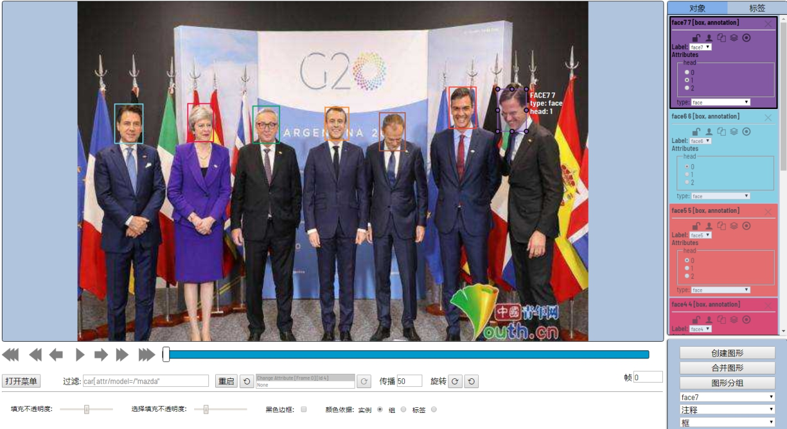
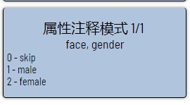

- [用户指南](#用户指南)
  - [界面](#界面)
    - [底部面板](#底部面板)
    - [设置](#设置)
  - [标注基础知识说明](#标注基础知识说明)
    - [形状类型](#形状类型)
    - [框的注释](#框的注释)
    - [带点的注释](#带点的注释)
    - [属性的注释](#属性的注释)
    - [保存工作](#保存工作)
    - [快捷键](#快捷键)

# 用户指南 

## 界面

- ``Workspace`` — 显示图像的地方;
- ``Bottom panel`` （在工作区下） - 用于导航，过滤注释和访问工具菜单;
- ``Side panel`` —  包含两个列表：对象（在右侧栏上）和标签（在右侧栏上）;
- ``Bottom side panel`` — 包含主要标注功能（创建，合并，图形分组等）。在这里，您可以选择一种形状，要标注的标签和模式（注释或插值）

还有:
- ``设置`` (F2) — “打开菜单”底部面板内的按钮。包含不同的参数，可根据用户的需要进行调整。
- ``Context menu`` — 鼠标右键可用。

### 底部面板

---
转到第一帧和最新帧。

---
使用预定义步骤转到下一个/上一个帧。快捷方式： V- 向后退步，C- 向前迈出一步。默认情况下，步长为10 （更改路径：打开菜单- > 设置- > 播放器设置）。

---
转到下一个/上一个帧，步长等于1.快捷键：D- 上一个，F- 下一个。

---
播放帧序列或图像集。捷径:( 空格/space键，更改路径：打开菜单- > 设置- > 播放速度）。

---
转到指定的框架。按~可聚焦元素。

---

**打开菜单** 按钮

它是注释工具的主菜单。它可用于下载，上载和删除注释。

按钮分配：

- ``打开任务`` — 在cvat仪表板中打开任务
- ``运行ReID合并`` — REID应用程序使用深度学习模型自动合并相邻帧之间的边界框。您可以使用“合并”和“拆分”功能来编辑自动生成的注释[阅读更多](/cvat/apps/reid).
- ``转储注释`` — 从任务下载注释
- ``上传注释`` — 将注释上载到任务
- ``删除注释`` — 从当前任务中删除注释
- ``设置`` —  打开设置菜单
- ``全屏播放`` — 全屏播放器模式
- ``切换到属性注释模式`` — 切换到属性注释模式
- ``帮助`` — 打开帮助
- ``保存工作`` — 保存当前作业的注释。该按钮显示保存过程

它还显示有关当前任务的统计信息，例如：
- 任务名称
- 任务的状态: ``annotation``, ``validation`` or ``completed task``
- 关于任务的技术信息
- 创建的边界框数量，按标签（例如车辆，人）和注释类型（多边形，方框等）排序

---

### 设置

按F2进入设置菜单。

---

## 标注基础知识说明

### 形状类型

您可以使用以下四种形状对图像进行注释：
- ``框``
- ``多边形``
- ``折线``
- ``点``
- ``auto segmentation``

它们看起来像是这样的：

 

 

### 框的注释

用法示例：
- 为一组图像创建新注释。
- 添加/修改/删除现有注释的对象。

1.  在开始之前，您需要检查是否标签（例：“face”）和“注释”已选中：

 

2.  创建一个新注释：

    -   预先选择正确的形状（框、点、多边形等）和标签（创建任务时由您指定）：

         

    -   单击“创建图形”按钮或N快捷键创建边界框。选择框的左上角及右下角两个点。您的第一个标注框就创建好了！

        

    -   您可以使用鼠标调整边界和边界框的位置。框的大小显示在右上角，单击框的一个点都可以选中它。还可以使用CTRL+Z撤消操作，并可以使用SHIFT+CTRL+Z或CTRL+Y重做操作。

3.  在对象列表中，您可以看到标记的人脸。在侧面板中，可以在“对象-选择属性”、“更改其标签”或“删除”框下执行其他基本操作。
        
4.  下图是“注释”模式中完整标注的图片的示例。
        

### 带点的注释

它用于人脸特征点的标注。

在开始之前，您必须确保点所对应框的标签名称（例：“face1”）及形状选项框的“点”已选中。

注意，人脸框和其需要标注的特征点的标签名称必须一致。

按N键进入绘图模式。现在，您可以开始标注必要的区域。再次按N键完成区域标注。如果您想删除它们，请按DELETE。注意，该工具是以组为单位进行删除。（例：face1标签下标注了5个点，那么将删除5个所有点）

按SHIFT键双击将打开点形状编辑器。在那里，可以在现有形状中创建新点。此外，您可以在“多边形形状大小”字段中设置固定数量的点，然后绘图将自动停止。点击 自动分组-所有点都将被视为在单个开始和完成之间链接。您可以在绘图时放大/缩小（滚动鼠标滚轮时）和移动（单击鼠标滚轮并移动鼠标时）。可以在绘制对象后拖动它，并在完成对象后固定各个点的位置。完成后可以添加/删除点。

   
### 属性的注释

-   在此模式下，您可以使用键盘在对象和帧之间快速导航来编辑属性。按下Shift+Enter快捷键进入模式。之后，您可以使用键盘更改属性。

    

-   活动属性将高亮为红色（即gender）。在这种情况下，查看底部侧面板，查看用于更改属性的所有可能的快捷方式。按键盘上的“2” 数字键可将female设为属性指定值。

     

-   按键盘上的Up Arrow/ Down Arrow可转到下一个/上一个属性。在这种情况下，按下后Down Arrow您就可以编辑Age属性。

     

-   使用Right Arrow/ Left Arrow键移动带有注释的上一个/下一个图像。

### 保存工作

### 快捷键

|                                       |                                                |
|----------------------                 |------------------------------                  |
| ``L``                                 | 切换活动形状的锁定属性                            |
| ``L+T``                               | 切换当前帧上所有形状的锁定属性                      |
| ``Q`` or ``Num Devision``             | 切换活动形状的遮挡属性                            |
| ``N``                                 | 开始绘制/停止绘制                                |
| ``M``                                 | 开始合并/应用更改                                |
| ``G``                                 | 开始组/应用更改                                  |  
| ``Shift + G``                         | 重置所选形状的组                                 |
| `` Ctrl + (1,2,3,4,5,6,7,8,9)``       | 更改现有对象的形状标签                            |
| ``Shift + (1,2,3,4,5,6,7,8,9)``       | 更改标签默认标签                                 |
| ``b-框,p-点,a-自动注释,s-多边形,l-折线``  | 更改图形类型                                    |
| ``Enter``                             | 改变突出形状的颜色                                |
| ``Shift+B / Alt+B``                   | 增加/减少图像的亮度                               |
| ``Shift+C / Alt+C``                   | 增加/减少图像的对比度                             |
| ``Shift+S / Alt+S``                   | 增加/减少图像的饱和度                             |
| ``H``                                 | 切换活动形状的隐藏模式                            |
| ``K``                                 | 切换活动形状的关键帧属性                           |
| ``O``                                 | 切换外部属性以获得活动形状                         |
| ``T + H``                             | 切换所有形状的隐藏模式                            |
| ``Del, Shift + Del``                  | 删除活动形状（使用shift删除强制）                  |
| ``~``                                 | 专注于“去框架”元素                               |
| ``F``                                 | 转到下一个玩家框架                                |
| ``D``                                 | 移到上一个播放器框架                              |
| ``V``                                 | 前进几帧                                        |
| ``C``                                 | 向后移动几帧                                     |
| ``R``                                 | 移动到突出显示的轨道的下一个关键帧                  |
| ``E``                                 | 移动到突出显示的轨道的上一个关键帧                  |
| ``Left Arrow``                        | 移动到满足过滤器的prev框架                        |
| ``Right Arrow``                       | 移动到满足过滤器的下一帧                           |
| ``Space``                             | 切换播放器的播放/暂停                             |
| ``F1``                                | 打开帮助窗口                                     |
| ``F2``                                | 打开设置窗口                                     |
| ``Ctrl+S``                            | 保存服务器上的工作                                |
| ``Ctrl + C``                          | 将活动形状复制到缓冲区                            |
| ``Ctrl+B``                            | 传播活跃的形状                                   |
| ``Ctrl + V``                          | swich粘贴模式                                   |
| ``Shift + Enter``                     | 切换属性注释模式                                 |
| ``Down Arrow``                        | 移动到属性注释模式中的下一个属性                    |
| ``Up Arrow``                          | 移动到属性注释模式中的上一个属性                    |
| ``Tab``                               | 在属性注释模式中移动到下一个形状                    |
| ``Shift + Tab``                       | 在属性注释模式中移动到上一个形状                    |
| ``1,2,3,4,5,6,7,8,9,0``               | 在属性注释模式中设置相应的属性值                    |
| ``Alt + G + "+", Alt + G + "-"``      | 增加/减少网格不透明度                             |
| ``Alt + G + Enter``                   | 改变网格颜色                                     |
| ``Ctrl + Z``                          | 撤消                                           |
| ``Ctrl + Shift + Z / Ctrl + Y``       | 重做                                           |
| ``Esc``                               | 取消活动模式                                     |
| ``Ctrl + R``                          | 顺时针图像旋转                                   |
| ``Ctrl + Shift + R``                  | 逆时针图像旋转                                   |
| ``Alt + >``                           | 切换下一个默认形状类型                            |
| ``Alt + <``                           | 切换以前的默认形状类型                            |
